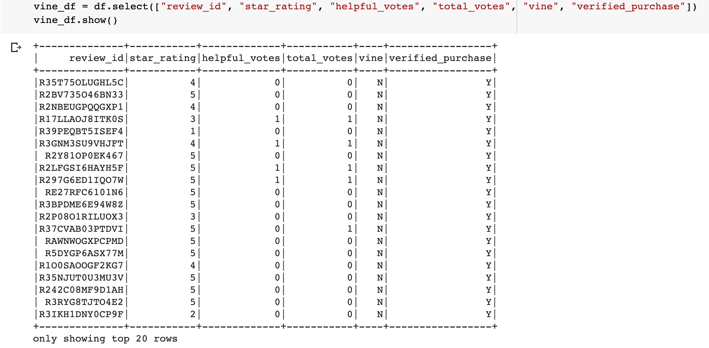
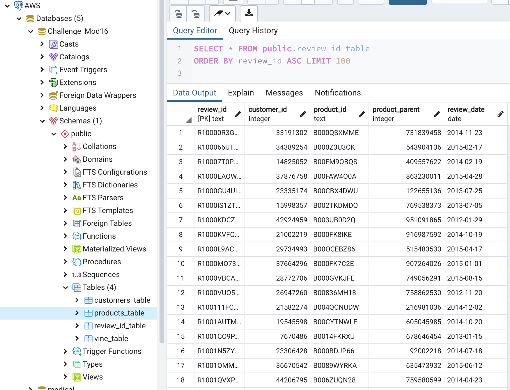
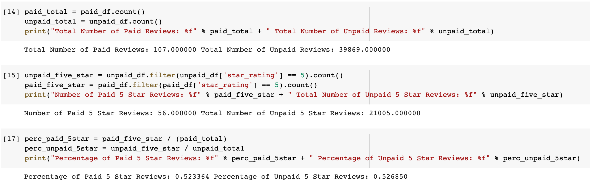

# Amazon Vine Analysis

## Overview of the analysis: 
This project was performed to analyze the reviews written by members of the Amazon Vine program. We evaluated a dataset of Outdoors product reviews using PySpark to Extract, Transform and Load the data into an Amazon Web Services (AWS) RDS instance of a Postgres database. We then analyzed the cleaned and transformed dataset of reviews to determine if there is any bias towards favorable reviews from members of the Vine program.

#### The product of our ETL & transformation of the original Outdoors product reviews dataset:
 

#### One of the tables created and uploaded to our Postgres database on AWS RDS:
 

## Results:
Our analysis shows the following results:

* Quantities of Vine and non-Vine reviews: 
    * Total Number of Vine (paid) Reviews: 107 
    * Total Number of non-Vine (unpaid) Reviews: 39,869

* Quantitied of 5 star reviews from Vine and non-Vine users:
    * Number of Vine (paid) 5 Star Reviews: 56 
    * Total Number of non-Vine (unpaid) 5 Star Reviews: 21,005

* Percentages of Vine  and non-Vine 5 star reviews:
    * Percentage of Vine (paid) 5 Star Reviews: 52.3364% 
    * Percentage of non-Vine (unpaid) 5 Star Reviews: 52.685%

#### Our pyspark code used to calculate total number of reviews, 5 star reviews and percentages for Vine and non-Vine member reviews:
 

## Summary
We found that of the almost 40,000 reviews in our cleaned and transformed dataset of Vine and non-Vine Outdoors product reviews we have relatively few Vine reviews (107) compared to non-Vine member reviews (39,869). We see 21,005 non-Vine 5 star reviews and 56 Vine 5 star reviews. As a percentage of total reviews we find very similar levels- Vine 5 star reviews are 52.3% of total reviews and non-Vine 5 star reviews are 52.7% of total reviews. Based on these very similar percentaged we do not believe we see any positivity bias in this review data. We could look at all of the review ratings (4 star, 3 star, etc.) to further analyze whether any positivity bias is detected.